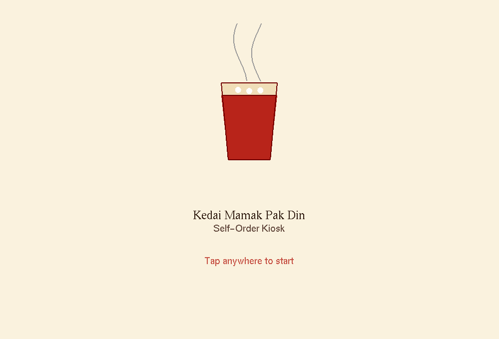
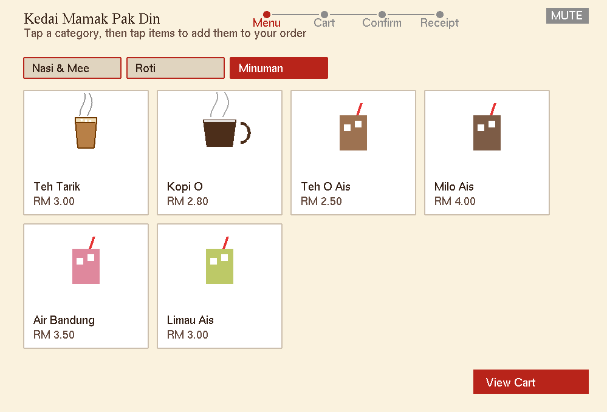
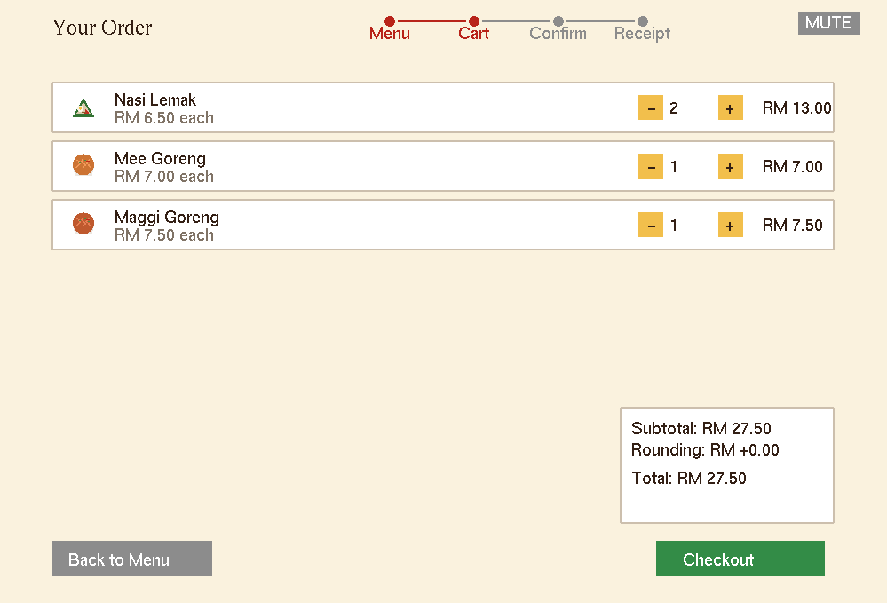
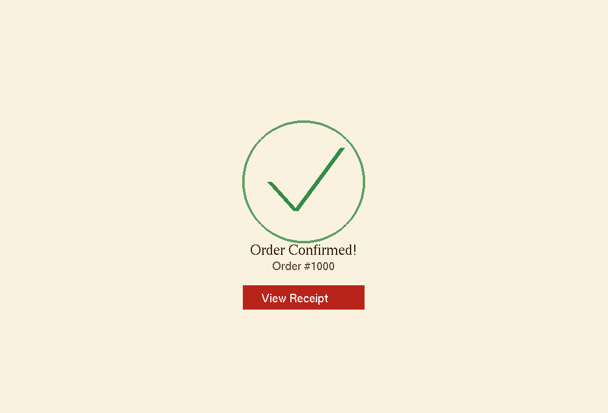
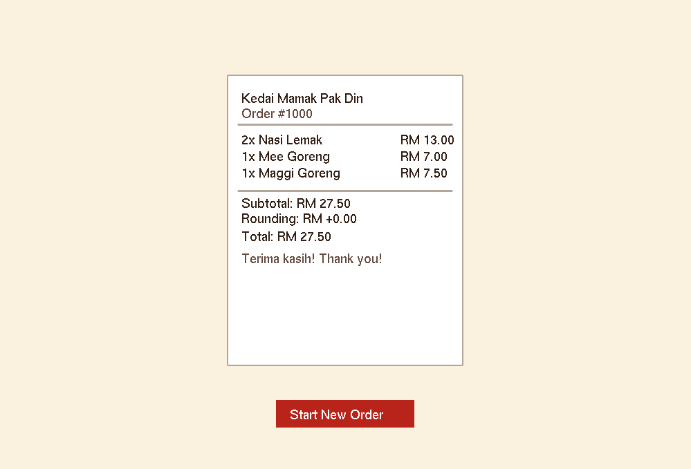

# Kedai Mamak Pak Din — Self-Order Kiosk (Beta Prototype)

**HCI Assignment 2** — a multi-screen UI prototype incorporating visual and
audio interaction techniques for a local organisation, built with a standard
graphics API (**OpenGL**, via GLUT for windowing/input, and `pygame.mixer`
for audio).



For the full HCI rationale behind every design decision, see
[`docs/design_rationale.docx`](docs/design_rationale.docx).

> **Note on the name:** "Kedai Mamak Pak Din" is a generic, fictional stall
> name chosen to represent the *mamak stall* business type broadly (a very
> common local eatery format in Malaysia), per the assignment's "local
> organisation" brief — it isn't based on a specific real chain.

## Screenshots

| Splash | Menu |
|---|---|
|  |  |

| Cart | Order Confirmation |
|---|---|
|  |  |

| Receipt |
|---|
|  |

## Table of Contents

- [The Organisation](#the-organisation)
- [Interaction Flow](#interaction-flow)
- [Why OpenGL + GLUT?](#why-opengl--glut)
- [Visual Techniques Used](#visual-techniques-used)
- [Audio Techniques Used](#audio-techniques-used)
- [Project Structure](#project-structure)
- [Setup & Running](#setup--running)
- [Controls](#controls)
- [Known Limitations](#known-limitations-beta-scope)
- [Next Steps](#next-steps-for-a-final-version)

---

## The organisation

*Kedai Mamak Pak Din* is a small local mamak stall — the kind of 24-hour,
open-air eatery found throughout Malaysia, serving roti, rice/noodle dishes,
and drinks like teh tarik. This prototype is a **self-order touchscreen
kiosk** for the counter — customers browse by category, review and adjust
their order, confirm it, and get a digital receipt (with the total rounded
to the nearest 5 sen, matching real cash-rounding practice in Malaysia).

---

## Interaction flow

```
Splash  →  Menu  →  Cart  →  Order Confirmation  →  Receipt  →  (loop)
```

- **Splash** — branding, an animated *teh tarik* pouring/pulling logo, tap-to-start prompt
- **Menu** — category tabs (Nasi & Mee / Roti / Minuman), item cards with vector icons, live cart badge
- **Cart** — itemised list with quantity steppers, subtotal + 5-sen rounding + total, back/checkout
- **Confirmation** — animated checkmark draw-in + chime, order number
- **Receipt** — items "print" in one at a time with a tick sound, then totals and a "Start New Order" button loops back to Splash

---

## Why OpenGL + GLUT?

OpenGL is the standard graphics API required by the assignment. GLUT provides
the windowing and input callbacks (mouse clicks, mouse motion, keyboard)
needed for a fully interactive multi-screen UI without a heavyweight
framework. All menu icons — including the signature animated teh tarik pour
— are drawn as procedural vector geometry directly through OpenGL primitives
rather than image textures, demonstrating direct use of the graphics API for
illustration, not just layout.

---

## Visual techniques used

| Technique | Where | HCI rationale |
|---|---|---|
| Icon-based, colour-coded item cards | Menu | Recognition rather than recall — scan icons instead of reading full names |
| Animated teh tarik "pull" logo | Splash | Distinctive, culturally-grounded branding moment rather than a generic icon |
| Category tabs with active-state highlighting | Menu | Reduces information density per screen |
| Hover highlighting | All interactive elements | Affordance — signals what's clickable before commitment |
| Click "pulse" animation | Menu item icons | Visibility of system status — confirms input was registered |
| Persistent cart badge | Menu | System status stays visible without navigating away |
| Progress breadcrumb | Menu, Cart | Gives users a mental model of where they are in the flow |
| Quantity steppers | Cart | Direct manipulation; easy error recovery |
| Disabled checkout when cart empty | Cart | Error prevention — invalid action is prevented, not attempted then rejected |
| Stroke-by-stroke animated checkmark | Confirmation | Draws attention to a significant state change |
| Screen fade transitions | All screens | Preserves continuity between steps |
| Skeuomorphic "printing" receipt | Receipt | Mirrors a familiar real-world artefact, builds trust in the output |

See the design rationale document for the full breakdown, including a
Nielsen heuristic self-evaluation.

---

## Audio techniques used

| Sound | Trigger | HCI rationale |
|---|---|---|
| Click blip | Any button/menu tap | Auditory confirmation of input |
| Rising/falling stepper blips | Cart quantity +/− | Distinguishes increase from decrease by pitch alone |
| Whoosh sweep | Every screen transition | Reinforces the visual fade; signals navigation occurred |
| Two-tone confirmation chime | Checkout | Distinct from routine clicks — signals a different class of event |
| Mechanical tick | Each receipt line "printing" in | Paces the reveal; mirrors a real receipt printer |
| Looping ambient pad | Continuous background | Atmosphere, kept subtle so it doesn't mask feedback sounds |
| Mute toggle (button or `M` key) | User-initiated | Respects user control — never forces audio on the user |

All audio assets are procedurally generated placeholder tones (see
`gen_assets.py`) so the prototype runs with zero external asset dependencies.
Swap in real recorded/branded sounds for a production version.

---

## Project structure

```
kedai-mamak-kiosk/
├── main.py             # screen state machine, GLUT callbacks, draw/input logic
├── config.py            # menu data, colours, layout constants, screen IDs
├── audio.py              # AudioManager (pygame.mixer wrapper, graceful degradation)
├── shapes.py              # procedural vector icon drawing (OpenGL primitives)
├── gen_assets.py           # generates placeholder .wav audio assets
├── assets/                  # click/confirm/whoosh/tick/ambient/step .wav files
├── docs/
│   └── design_rationale.docx   # full HCI design rationale for submission
├── requirements.txt
└── README.md
```

---

## Setup & running

Requires Python 3.9+ and a system with a display (this is a windowed desktop
app, not a web app).

### 1. System dependencies (Linux/Debian/Ubuntu)

```bash
sudo apt-get install freeglut3-dev libglu1-mesa
```

macOS and Windows ship with OpenGL/GLUT support usable via PyOpenGL directly;
on Windows you may need the `freeglut.dll` bundled with PyOpenGL, or install
via `conda install -c conda-forge freeglut`.

### 2. Python dependencies

```bash
pip install -r requirements.txt
```

### 3. Generate audio assets (first run only)

```bash
python gen_assets.py
```

### 4. Run the kiosk

```bash
python main.py
```

> On Windows, if `python3` isn't recognised, use `python` instead.

---

## Controls

- **Splash:** click/tap anywhere to enter the menu
- **Menu:** click a category tab to filter items; click an item card to add it to the cart; click "View Cart" to review
- **Cart:** use +/− to adjust quantities; "Back to Menu" to keep browsing; "Checkout" to confirm (disabled while empty)
- **Confirmation:** click "View Receipt" once the checkmark finishes animating
- **Receipt:** click "Start New Order" once totals have finished "printing" in
- **Mute / press `M`** — toggles all audio
- **Press `Q` or `Esc`** — quit

---

## Known limitations (beta scope)

This is a beta/proof-of-concept, not a production app:
- No persistence — cart and order history reset on new order or app restart
- No payment integration
- Audio assets are procedurally generated placeholder tones, not real recorded audio
- Text rendering uses GLUT bitmap fonts (basic, not anti-aliased)
- No formal usability testing with real users has been conducted yet
- Layout assumes a roughly fixed window size; not tested on an actual touchscreen
- Menu, categories, and prices are illustrative and not based on a real stall's actual pricing

See `docs/design_rationale.docx` (Section 9) for the full limitations and
future-work discussion.

---

## Next steps for a final version

- Replace placeholder tones with real recorded kitchen/stall ambience and sounds
- Add order customisation (spice level, add-ons, roti fillings)
- Run a moderated usability test with representative users and iterate
- Add basic accessibility support (larger text mode, high-contrast mode, Bahasa Malaysia language toggle)
- Touch-target sizing pass for a real touchscreen kiosk
